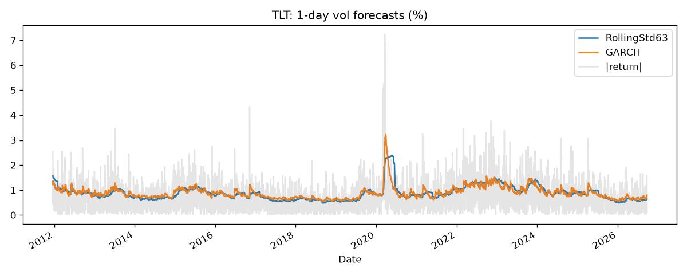
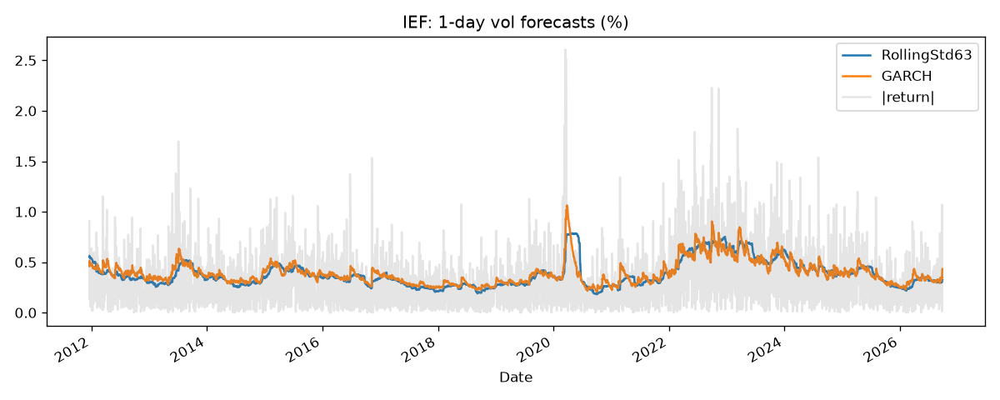
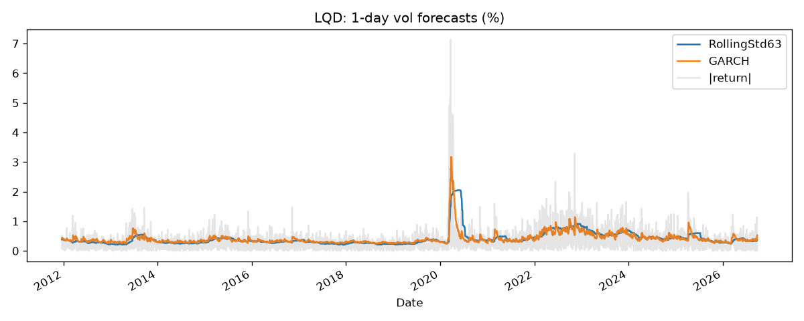
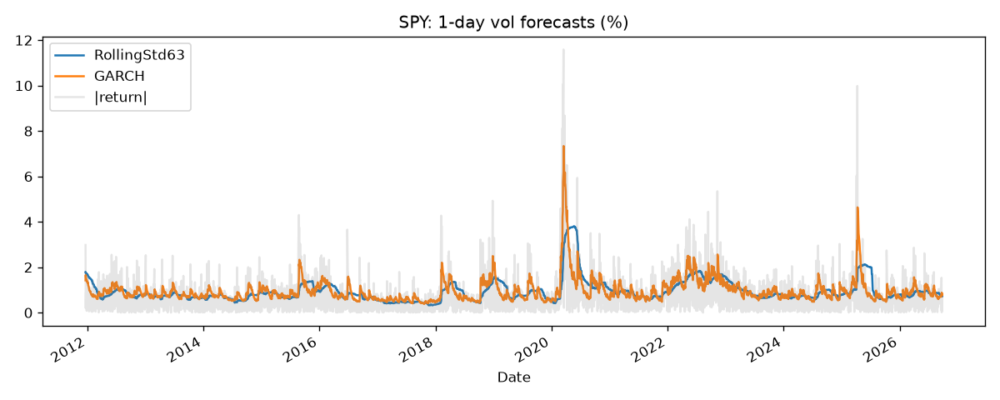

# Volatility Forecasting: GARCH vs Baselines on Rates, Credit & Equity ETFs

Out-of-sample 1-day-ahead variance forecasts for four ETFs: TLT (long Treasuries), IEF (intermediate Treasuries), LQD (investment-grade credit) and SPY (US equities).

## Method
- Models: 63-day rolling variance, EWMA (lambda = 0.94), GARCH(1,1) and GJR-GARCH(1,1,1), both with Student-t errors (Python `arch` library)
- Expanding window, minimum 1,000 observations, refit every 21 trading days
- Forecast for day t uses only data through day t-1 (no look-ahead)
- 3,712 out-of-sample daily forecasts per asset
- Scored with MSE and QLIKE against squared returns (a noisy proxy for realized variance). Lower is better for both.

## Results

| Asset | Model | MSE | QLIKE |
|---|---|---|---|
| TLT | GARCH | 3.6712 | 0.6573 |
| TLT | GJR-GARCH | 3.7445 | 0.6577 |
| TLT | EWMA_0.94 | 3.5912 | 0.6639 |
| TLT | RollingStd63 | 4.0235 | 0.6848 |
| IEF | GARCH | 0.1138 | -0.9877 |
| IEF | GJR-GARCH | 0.1141 | -0.9871 |
| IEF | EWMA_0.94 | 0.1124 | -0.9817 |
| IEF | RollingStd63 | 0.1177 | -0.9600 |
| LQD | GJR-GARCH | 1.4980 | -0.9101 |
| LQD | GARCH | 1.5306 | -0.9073 |
| LQD | EWMA_0.94 | 1.5344 | -0.9027 |
| LQD | RollingStd63 | 1.8159 | -0.8466 |
| SPY | GJR-GARCH | 14.7216 | 0.6390 |
| SPY | GARCH | 14.9015 | 0.6685 |
| SPY | EWMA_0.94 | 16.5584 | 0.7356 |
| SPY | RollingStd63 | 19.4894 | 0.8445 |

QLIKE values are only comparable within an asset (negative values are a scale effect).

## Findings
- GARCH-family models beat the rolling-window baseline on QLIKE for all four assets.
- The largest improvement is on SPY, where GJR-GARCH cuts MSE by about 24% versus the baseline, consistent with the leverage effect (volatility rising more after negative returns).
- On TLT and IEF, EWMA has the lowest MSE but GARCH has the lowest QLIKE; MSE is more sensitive to a few extreme days.

## Charts





## Limitations
- Squared daily returns are a noisy variance proxy; intraday realized variance would be better.
- No formal significance test (e.g., Diebold-Mariano); differences between GARCH and GJR-GARCH on TLT and IEF are very small.
- One-day horizon only.

## Next steps
HAR-RV benchmark, Diebold-Mariano tests, multi-day horizons.

## How to run
```
pip install -r requirements.txt
python vol_forecast.py
```
Add `--synthetic` for a quick test on simulated data.